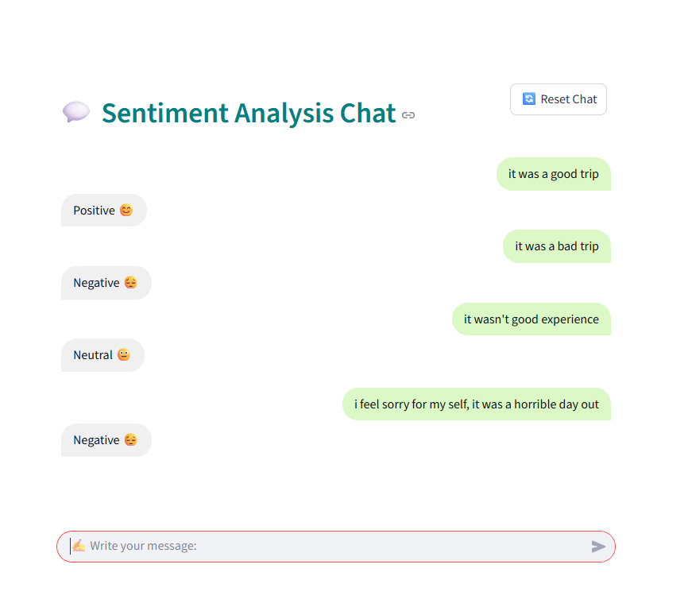

# 🌍 Universal Sentiment & Text Classifier (USTC)

The **Universal Sentiment & Text Classifier (USTC)** is a complete end-to-end project for **text classification and sentiment analysis**.  
It can analyze **any type of message** (reviews, comments, feedback, etc.) and classify it into:

- **Negative 😔**
- **Neutral 😐**
- **Positive 😊**

Unlike domain-specific solutions, USTC is designed to be **universal** and adaptable across multiple contexts.

---

## 🛠 Project Pipeline

USTC covers the **entire lifecycle** of a text analytics project:

1. **Data Collection**  
   - Scraping data from multiple domains.  
   - In this simplified version: reviews are collected from `airlinequality.com`.  

2. **Data Processing & Cleaning**  
   - Preprocessing raw text (tokenization, cleaning, normalization).  

3. **Model Training**  
     - **LSTM-based sentiment classification** — this repository implements and uses an LSTM model for sentiment prediction.
4. **Backend API**  
   - Implemented with **Flask**, exposed via **Ngrok** for public access.  
   - Serves predictions through a `/predict` endpoint.  

5. **Frontend (Flutter App)**  
   - Mobile application to interact with the backend.  
   - Provides a **chat-like interface** for entering messages and viewing sentiment classification results.  

---

## 📖 Documentation & Notebook

The full documentation, backend code, and step-by-step explanations are provided in this Colab notebook:  

👉 [USTC – Colab Notebook](https://colab.research.google.com/drive/1SY4cj98YITbJczXumAJFLUxPxesrXj5K?usp=sharing)

⚠️ **Note for users**:  
If you only want to run the app, you need to execute **only cells 1, 5, and 6** in the notebook.  

---

## 📱 Flutter Application

This repository contains a **Flutter app** — a second frontend for USTC (mobile).

### Features:
- Dynamic **backend URL input**.
- Chat interface to send messages and receive predictions.  
- Real-time sentiment classification into 3 categories.  

### Usage:
1. Run the backend via the Colab notebook (cell 5).  
   - A **Ngrok URL** will be generated (example: `https://1234-56-78-90-00.ngrok-free.app/predict`).  
2. Launch the Flutter app.  
3. Paste the Ngrok link into the **Backend URL** field in the app bar.  
4. Enter any message → receive sentiment classification instantly.

## 📱 Flutter Application (Screenshots)

  

---

## 💻 Streamlit Application (Screenshots)

  

